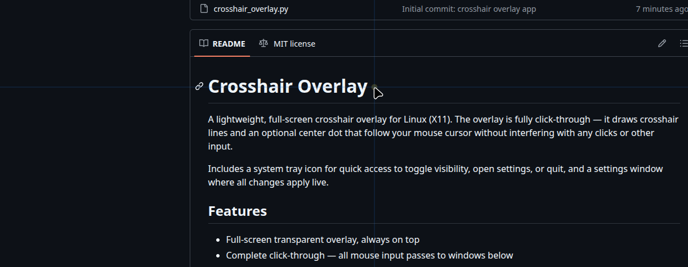
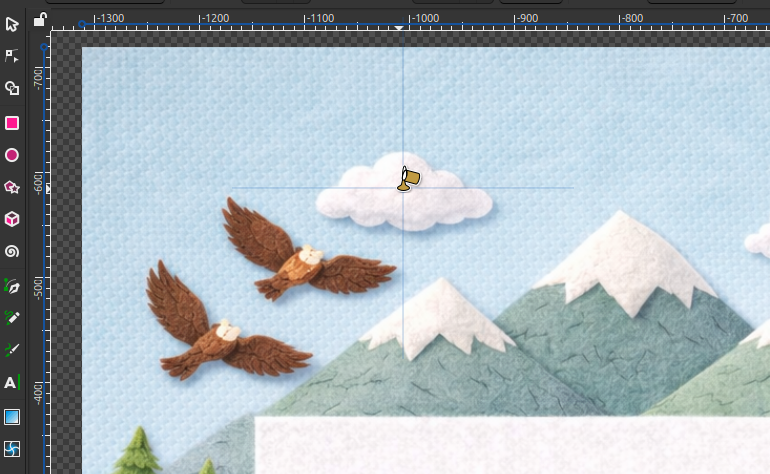
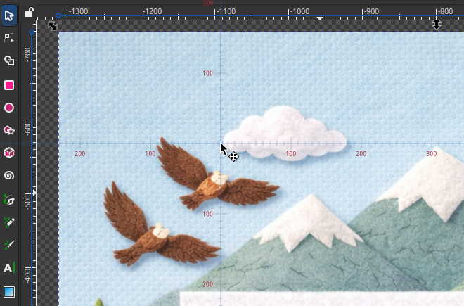
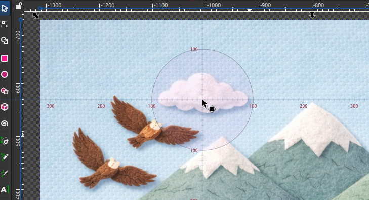
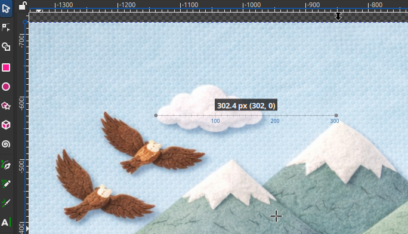

# Crosshair Overlay

A lightweight, full-screen crosshair overlay for **Linux** and **Windows**. The overlay is fully click-through — it draws crosshair lines and an optional center dot that follow your mouse cursor without interfering with any clicks or other input.

Includes a built-in **pixel ruler** with configurable tick marks and distance labels, plus a dedicated **measure mode** for click-and-drag distance measurement between any two points on screen — ideal for graphic design, game development, UI work, or any task that benefits from precise pixel measurements.

A system tray icon provides quick access to toggle visibility, open settings, or quit. All settings apply live and persist across restarts.

## Screenshots

The crosshair overlay in action, showing the crosshair lines and center dot following the cursor:



Using the crosshair with a radius of 170 in Inkscape, making the exact point of the fill tool easily seen:



The built-in ruler with tick marks and distance labels — measure pixel distances directly from your cursor in any application:



The center dot scaled up with a stroke outline, useful for highlighting a precise area or creating a circular reference point:



Measure mode with ruler ticks and Ctrl-snap — click and drag to measure pixel distances between any two points, with signed (x, y) coordinates:



## Features

- Full-screen transparent overlay, always on top
- Complete click-through — all mouse input passes to windows below
- Customizable crosshair line color, width, and opacity
- Full screen or fixed-radius crosshair size
- Center dot with independent fill and stroke (color, opacity, width), toggleable on/off
- **Pixel ruler** — tick marks along the crosshair lines with configurable spacing and major/minor sizes
- **Distance labels** — pixel-distance readouts at major ticks with customizable color, opacity, and font size
- **Measure mode** — click and drag to measure the distance between any two points on screen
  - Displays total distance in pixels and signed (x, y) offset from the origin (right/up positive)
  - Ruler ticks along the measurement line, reusing the crosshair's tick settings
  - Hold **Ctrl** while dragging to snap the angle to 15° increments (0°, 15°, 30°, 45°, etc.)
  - Press **Escape** to return to crosshair mode
- **Favorites** (Linux) — save named presets of your crosshair settings and switch between them instantly from the settings window or the tray menu
- All values editable via spin buttons (type exact values or use arrows)
- Live-preview settings window with responsive layout
- System tray icon with toggle, mode switching, settings, favorites, and quit
- Settings persist across restarts
- Multi-monitor support

## Platform Support

| | Linux | Windows |
|---|---|---|
| **Overlay** | GTK 3 + Cairo | Win32 API + GDI+ (ctypes) |
| **Settings** | GTK 3 | tkinter |
| **Tray icon** | AppIndicator3 | pystray + Pillow |
| **Config path** | `~/.config/crosshair-overlay/config.json` | `%APPDATA%\crosshair-overlay\config.json` |
| **Favorites** | `~/.config/crosshair-overlay/favorites.json` | — |

## Linux

### Requirements

- Python 3
- GTK 3 (`gir1.2-gtk-3.0`)
- AppIndicator3 (`gir1.2-appindicator3-0.1`)
- X11 display server

On Linux Mint / Ubuntu / Debian:

```bash
sudo apt install python3 gir1.2-gtk-3.0 gir1.2-appindicator3-0.1
```

Most of these are pre-installed on Linux Mint.

### Usage

```bash
python3 linux/crosshair_overlay.py
```

## Windows

### Requirements

- Python 3 — download from [python.org](https://www.python.org/downloads/) and run the installer
  - **Important:** check **"Add python.exe to PATH"** during installation
- pystray
- Pillow

After installing Python, open a Command Prompt or PowerShell and install the dependencies:

```bash
pip install pystray pillow
```

### Usage

```bash
python windows\crosshair_overlay.py
```

## Controls

A crosshair will appear on screen following your cursor, and a tray icon will appear in your system tray. Use the tray menu to:

- **Toggle Crosshair** — show or hide the overlay
- **Mode: Crosshair / Measure** — switch between the cursor-following overlay and click-and-drag distance measurement
- **Settings** — open the settings window to adjust appearance
- **Favorites** (Linux) — quickly load a saved preset from the tray menu
- **Quit** — exit the application

### Measure mode

Select **Measure** from the tray menu. Click and drag anywhere on screen to draw a measurement line. The label shows the total distance in pixels and the signed (x, y) offset from the click origin (right and up are positive). If tick marks are enabled, ruler ticks appear along the measurement line using the same settings as the crosshair ruler.

Hold **Ctrl** while dragging to snap the line angle to the nearest 15° increment. Press **Escape** to return to crosshair mode.

To stop the app from the terminal, press `Ctrl+C`.

## Configuration

Settings are stored in a JSON config file (see platform table above) and are created automatically on first run with sensible defaults:

| Setting | Default | Description |
|---|---|---|
| `line_color` | `[0.9, 0.9, 0.9]` | Crosshair line RGB (0.0 - 1.0) |
| `line_width` | `1.0` | Line thickness in pixels |
| `line_opacity` | `0.35` | Line opacity (0.0 - 1.0) |
| `crosshair_fullscreen` | `true` | Lines span the full screen |
| `crosshair_radius` | `100` | Line radius from center in pixels (when not fullscreen) |
| `dot_enabled` | `true` | Show center dot |
| `dot_radius` | `3` | Dot radius in pixels (1 - 2000) |
| `dot_fill_color` | `[1.0, 0.3, 0.3]` | Dot fill RGB (0.0 - 1.0) |
| `dot_fill_opacity` | `0.6` | Dot fill opacity (0.0 - 1.0) |
| `dot_stroke_color` | `[1.0, 1.0, 1.0]` | Dot stroke RGB (0.0 - 1.0) |
| `dot_stroke_opacity` | `0.0` | Dot stroke opacity (0.0 - 1.0) |
| `dot_stroke_width` | `1.0` | Dot stroke width in pixels |
| `tick_enabled` | `false` | Show ruler tick marks along crosshair lines |
| `tick_color` | `[0.9, 0.9, 0.9]` | Tick mark RGB (0.0 - 1.0) |
| `tick_opacity` | `0.3` | Tick mark opacity (0.0 - 1.0) |
| `tick_spacing` | `10` | Pixels between minor ticks (5 - 200) |
| `tick_major_every` | `5` | Every Nth tick is a major (longer) tick |
| `tick_minor_length` | `3.0` | Minor tick length in pixels (each side of line) |
| `tick_major_length` | `6.0` | Major tick length in pixels (each side of line) |
| `tick_labels` | `false` | Show pixel-distance labels at major ticks |
| `tick_label_color` | `[0.9, 0.9, 0.9]` | Label text RGB (0.0 - 1.0) |
| `tick_label_opacity` | `0.5` | Label text opacity (0.0 - 1.0) |
| `tick_label_size` | `9.0` | Label font size in pixels (6 - 24) |

## Notes

The crosshair overlay will appear in screenshots only if your screenshot tool is set to capture the cursor.

## License

[MIT](LICENSE)
